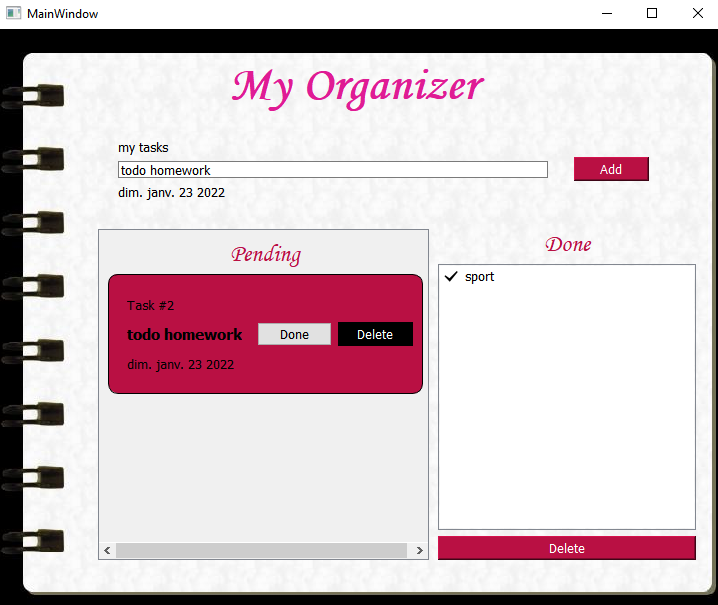

# ToDo Application using containers 


## Firdawse Guerbouzi - Meryem Badaoui

The goal of the homework is to create an application to manage our tasks , sadly this will be our last practical session from this memorable module , so let's enjoy doing it !

# Table of content
- todo app using **ITEM BASED**
   - Adding new tasks
   - Creating new widget for showing new tasks
   - moving task from pending to done
   - delete tasks 
   - saving  *SQLite database*
   - loading tasks from *SQLite database*
  

- todo app using **MVC Model**  
  - selecting multiple items 
  - deleate selected items
  - drag and drop
  - saving  *SQLite database* 
   - loading data 


  

 # *item based* model
 this is how our application will look like   



>let's start  

first, and after creating the layout containing QLabel to enter the description of the task and adding the QPushButton for adding it we connect it to its slot 
```c++
 // Connect the add new task button
       connect(ui->AddNewBtn, SIGNAL(clicked()), this, SLOT(SlotAddNewTask()));
```

and here is the implementation of *SlotAddNewTask()*

``` c++
void todo::SlotAddNewTask() {

    // Get the line edit text
    QString taskName = ui->NewTaskLineEdit->text();
    // Get current date
    QString date = QDate::currentDate().toString();

    createNewTask(taskName, date);

}
```
our function createNewTask creates a widget following this hierarchy


    
       + Hframe (Frame)
           + Vframe (Frame)
               + titlelabel (Label)
               + tasklabel (Label)
               + datelabel (Label)
           + spacer (Horizontal spacer)
           + deleteBtn (PushButton)
    
before starting the implementation we have been using an interesting concept which is the [**qobject_cast**](https://doc.qt.io/qt-5/qobject.html#qobject_cast) ; it returns the given object cast to type T if the object is of type T (or of a subclass); otherwise returns nullptr. If object is nullptr then it will also return nullptr.    


>here is a [link](https://stackoverflow.com/questions/43994584/what-is-qobject-cast) of an explaination with simple terms.  

Now let's split our function for a clear understanding
``` c++
void todo::createNewTask(QString taskName, QString date) {

    if(taskName!=""){
    // Get the parent widget which the widget created to be child in
    QVBoxLayout* vMainLayout = qobject_cast<QVBoxLayout*>(ui->AllNewTasksContents->layout());

    // Create Frame for the main widget container
    QFrame* Hframe = new QFrame();
    Hframe->setFrameStyle(QFrame::StyledPanel);
    // Create Horizontal Box Layout as the Frame layout and also for easily add widget inside it
    
    QHBoxLayout* newTask = new QHBoxLayout(Hframe);
    Hframe->setLayout(newTask);

    // Create Frame for the details container...
    QFrame* Vframe = new QFrame();
    QVBoxLayout* taskDetails = new QVBoxLayout(Vframe);
    Vframe->setLayout(taskDetails);

    QLabel* titlelabel = new QLabel(tr("Task #%1").arg(vMainLayout->count())); // task title
    taskDetails->addWidget(titlelabel);
    QLabel* tasklabel = new QLabel(taskName); // task name
    taskDetails->addWidget(tasklabel);
    QLabel* datelabel = new QLabel(date); // task date created
    taskDetails->addWidget(datelabel);

    // Insert the task details frame inside main task box layout
    newTask->insertWidget(0, Vframe);

    // Insert horizontal spacer in between Vframe and deleteBtn
    QSpacerItem* spacer = new QSpacerItem(100, 100, QSizePolicy::Policy::Expanding, QSizePolicy::Policy::Minimum);
    newTask->insertSpacerItem(1, spacer);

    // Insert delete button
    QPushButton* deleteBtn = new QPushButton("Delete");
    newTask->insertWidget(2, deleteBtn);
    QPushButton* done = new QPushButton("Done");
    newTask->insertWidget(2, done);

    
    // Insert into parent ui frame
    vMainLayout->insertWidget(vMainLayout->count()-1, Hframe);
```
then we store the current duplicated widget in the delete and done button property for easy reference.  

 This is a useful function if we want to reference any widgets to a specific button
 
``` c++

    deleteBtn->setProperty("CurrentTask", QVariant(QVariant::fromValue<QFrame*>(Hframe)));

    done->setProperty("CurrentLabel", QVariant(QVariant::fromValue<QLabel*>(tasklabel)));

    done->setProperty("CurrentTask", QVariant(QVariant::fromValue<QFrame*>(Hframe)));

```
then , here is the connections of delete and done buttons  

``` c++
// Connect the delete button
    connect(deleteBtn, SIGNAL(clicked()), this, SLOT(SlotDeleteTask()));

    //connect donne button
    connect(done, SIGNAL(clicked()), this, SLOT(SlotDone()));
```
Now each time we will add a task a widget will appear smoothly ,exactly like that


Now ,deleting a task ;

``` c++
void todo::SlotDeleteTask() {
    // Get the sender widget
    QPushButton* fromButton = (QPushButton*)sender();

    // Get the widget referenced in the property
    QVariant var;
    var = fromButton->property("CurrentTask");
    QFrame* taskHBox = qvariant_cast<QFrame*>(var);

    taskHBox->deleteLater();
    delete taskHBox;
}
```
## Moving task from pending to done 

Once the done button is clicked, the current task must be considered done and  shown on the done listWidget ,at the same time deleated from the pending frame 

``` c++
void todo::SlotDone(){
    QPushButton* fromButton = (QPushButton*)sender();

    QVariant var;
    var = fromButton->property("CurrentLabel");
    QFont f;
    QLabel* label = qvariant_cast<QLabel*>(var);
   if(label->text()!=""){
    QIcon icon(":/done.png");
    icon.pixmap(5);
   auto item =new QListWidgetItem(icon,label->text());
   f.setPointSize(15); // It cannot be 0
   item->setFont(f);
   ui->listWidget->addItem(item);


            QVariant va;
            var = fromButton->property("CurrentTask");
            QFrame* taskHBox = qvariant_cast<QFrame*>(var);

            taskHBox->deleteLater();
            delete taskHBox;
```  
</br>  

  
   

***another lines for saving are added in this slot , let's keep it to the part below***

## Saving
 

Our application is working perfectly **BUT** the tasks entered to our application must remains in the app in future use or it will have no sense to start from scratch each time .

That's why we will work on saving the state of our application using database ,for that we will call the  [**QSqlDatabase**](https://doc.qt.io/qt-5/qsqldatabase.html) class that  handles the connections to a database.
 ### **Openning and closing Database**  
 Before creating any sqlite query we need to open the database first then closing it before
 so let's create functions for that 
``` c++
bool connOpen(){

database = QSqlDatabase::addDatabase("QSQLITE");
database.setDatabaseName("C://Users//PC//Desktop//todo.db");
        //check connection
if(database.open()){
return true;
}else {
QMessageBox::information(this,"failed", "connection failed");
return false;
}
};
```
```c++
void connClose(){
database.close();
database.removeDatabase(QSqlDatabase::defaultConnection);
    };
```


 ### **Saving new tasks**  

when we add a pending task it will be directly saved on a pending table of our database
``` c++
void todo::SlotAddNewTask() {

    // Get the line edit text
    QString taskName = ui->NewTaskLineEdit->text();
    if(taskName!=""){
    // Get current date
    QString date = QDate::currentDate().toString();

    createNewTask(taskName, date);

    connOpen();
    auto query =new QSqlQuery(database);
     query->prepare("INSERT INTO pending(name,date) VALUES(?,?)");
 
    query->addBindValue(taskName);
    query->addBindValue(date);

     if(query->exec())
         QMessageBox::information(this, tr("Success"),tr(" A new task has been added"));
     else
         QMessageBox::critical(this,"error :: ",query->lastError().text());

     connClose();
}}
``` 
Now if we press the button done the task will be deleated from **pending** table and added in **done** table
``` c++
void todo::SlotDone(){
//saving
connOpen();
auto query =new QSqlQuery(database);
query->prepare("INSERT INTO done2(name) VALUES(?)");

query->addBindValue(item->text());

if(!query->exec())
QMessageBox::critical(this,"error :: ",query->lastError().text());
//deleating 
QSqlQuery qry;
qry.prepare("DELETE FROM pending WHERE name='"+item->text()+"'");

qry.exec();

connClose();
}}
```

clearing from the done table is a piece of cake
``` c++
void todo::on_pushButton_clicked()
{    connOpen();
     QSqlQuery query;
     query.prepare("DELETE FROM done2");
     query.exec();
     connClose();
     ui->listWidget->clear();
}
```
**what's left?**  
the application shouldn't start from scratch each time we open it  ,that why in my constructor i will show all data stored in the databse

**Displaying the done tasks**
``` c++
connOpen();
auto qry =new QSqlQuery(database);
qry->prepare("select * from done2");
qry->exec();
int idName = qry->record().indexOf("name");
while (qry->next())
{
QString name = qry->value(idName).toString();
if(name!=""){
QIcon icon(":/done.png");
icon.pixmap(5);
auto item =new QListWidgetItem(icon,name);
ui->listWidget->addItem(item);
}
```
**Displaying the pending tasks**

``` c++
auto qry2 =new QSqlQuery(database);
qry2->prepare("select * from pending");
qry2->exec();
int Name = qry2->record().indexOf("name");
while (qry2->next())
{
QString name = qry2->value(Name).toString();
createNewTask(name,  QDate::currentDate().toString());
}
```
**So now ,our informations will be saved ,because every part of our application is linked to the database .**   

</br>

 # *MVC* model

Let's move on to more complicated model using mvc model which is a design pattern, a programming technique. 
>It's a "way to program and organize your code". 

The MVC architecture offers you to separate the elements of your program into 3 parts:

 - **The model**: this is the part that contains the data. 

 - **The view**: this is the part that takes care of the display. 

 - **The controller**: this the most algorithmic part, it's the brain of your program .


---
  
 </br> 
this is how our application will looks like  

 </br> 


  

**too much details to handle , let's start!**

for the design we 've been using **QtDesigner** and adding some **stylesheet** within 

this model doesn't differ a lot from the previous ,that why we won't repeat some steps .

After entring the description of the new task  the add slot will take care of setting up the tasks in the suitable place.
 we've used The **QStandardItemModel** class provides a generic model for storing custom data.

``` c++
void todomvc::on_pushButton_clicked()
{
    QString text =ui->lineEdit->text();
       connOpen();
    if(ui->checkBox->isChecked()){

          QStandardItem *item2 = new QStandardItem();
          item2->setText(text);
          item2->setIcon(QIcon(":/done.png"));
          listItem << item2;

          model->appendRow(item2);

          ui->listView->setModel(model);

           }

     else {

          QStandardItem *item2 = new QStandardItem();
          item2->setText(text);
          item2->setIcon(QIcon(":/done.png"));
          listItem2 << item2;

          model3->appendRow(item2);

          ui->listView_2->setModel(model3);

}
     connClose();
}
```


## selecting and clearing multiple items 

to select multiples rows from QListView we've select an extendedMode from **QAbstractItemView **class 

> ui->listView_2->setSelectionMode(QAbstractItemView::ExtendedSelection)  

</br>

  


then , to delete them  we have used The **QModelIndex** class to locate data in a data model
``` c++
void todomvc::on_clearSelect_clicked()
{

QStringList list;
QModelIndexList indexes = ui->listView->selectionModel()->selectedIndexes();
QVariant elementSelectionne = model->data(indexes[0] ,Qt::DisplayRole);
list << elementSelectionne.toString();
while(indexes.size()) {
model->removeRow(indexes.first().row());
indexes = ui->listView->selectionModel()->selectedIndexes();
QModelIndex indexElementSelectionne = ui->listView->selectionModel()->currentIndex();
QVariant elementSelectionne = model->data(indexElementSelectionne, Qt::DisplayRole);
list << elementSelectionne.toString();
     }
    
```
and ofcourse we need to delete them from the database also 
``` c++
  connOpen();
       for(int i=0;i<list.size();i++){
            QSqlQuery query;
           query.prepare("DELETE FROM done WHERE name='"+list[i]+"'");
           query.exec();
       }
        connClose();
```
## Drag and drop 

thank to the power of **MVC** this task  won't take much time , we 've used some propreties that hold the view's drag and drop behavior
``` c++
 ui->listView->setSelectionMode(QAbstractItemView::ExtendedSelection);
     ui->listView->dragDropOverwriteMode();
     ui->listView->setDragEnabled(true);
     ui->listView->setAcceptDrops(true);
     ui->listView->setDropIndicatorShown(true);
     ui->listView->setDefaultDropAction(Qt::MoveAction);
```


## Saving 

before closing our application , everything must be saved ,our status should remains the same 

that why we've implement a saving function that linked our listView data to sqlite database 

``` c++
void todomvc::saving(){

    connOpen();
    auto qry =new QSqlQuery(database);
    for(int i=0;i<listItem.size();i++){
        if(listItem[i]->text()!=""){
     qry->prepare("INSERT INTO done(name) VALUES(?)");
     qry->addBindValue(listItem[i]->text());
    }
}
    for(int i=0;i<listItem2.size();i++){
     qry->prepare("INSERT INTO tasks(name) VALUES(?)");
     qry->addBindValue(listItem2[i]->text());
    }

     qry->exec();
}
```

then linked it to the closeEvent 
``` c+
void todomvc::closeEvent(QCloseEvent *e)
{
    saving();
}
```

## loading 


last step is to handle the loading of data from database to our view 

``` c++
 connOpen();
        auto qry =new QSqlQuery(database);
        qry->prepare("select * from done");
        qry->exec();

        int idName = qry->record().indexOf("name");
        while (qry->next())
        {
          QStandardItem *item2 = new QStandardItem();
          QString name = qry->value(idName).toString();
          item2->setText(name);
          item2->setIcon(QIcon(":/done.png"));
          model->appendRow(item2);
          //  list where all the items of the session will be saved
          listItem << item2;
        }
             ui->listView->setModel(model);
        }
```

That's all , hope it will be interesting !
thank you!
